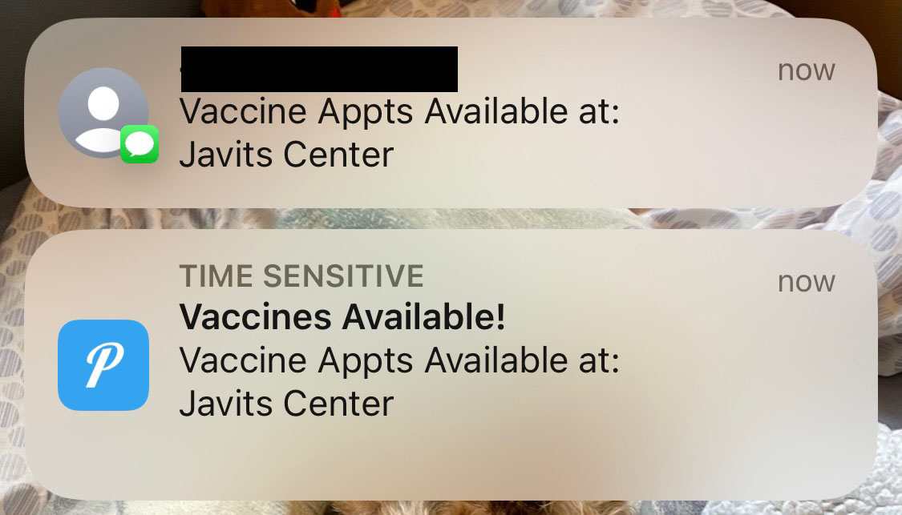

# NY State Vaccine Appointment Availability Notifications

A program to send pushover notifications and twilio texts when vaccine appointments become available using a python script running within a docker container
### Requirements
- a free [ScraperAPI](https://www.scraperapi.com) account (the script will not exceed the amount of free requests per week)
- a free [Twilio](https://www.twilio.com/) account
- a free [Pushover](https://pushover.net/) account
- (optional) a [healthchecks.io](https://healthchecks.io/) account
## To Run
1. Create a Pushover [API token](https://pushover.net/apps/build) for this app
2. (optional) create a healthchecks.io check for this app with cron expression `*/30 * * * *`
3. Rename `config.yaml.sample` to `config.yaml` and input your Twilio, ScraperAPI, and Pushover details into `config.yaml`
    - NOTE: ensure all phone number in `config.yaml` are in quotation marks and include +1, as seen in sample
4. Mark the locations that you would like to be notified about as `true` in `locations.yaml`
5. (optional) input the healthchecks.io check URL into docker-compose.yml
5. On your server, navigate to this directory and run `docker compose up -d` to start
